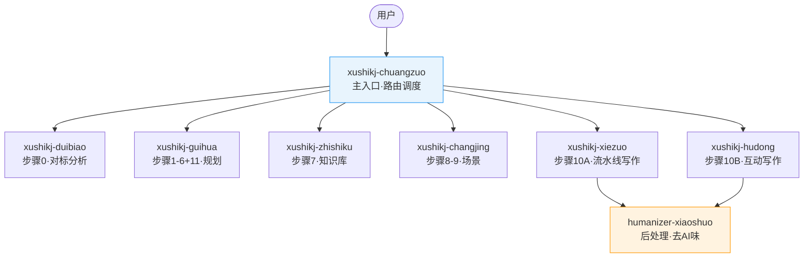
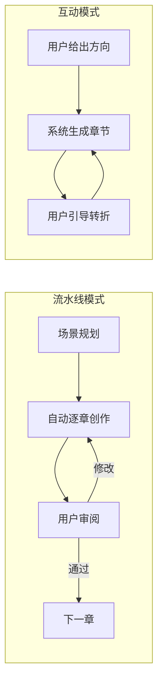

# 叙事空间创作系统 — 使用指南

## 这套系统是什么

叙事空间创作系统是一套运行在 Claude Code 上的商业小说创作工具包。它不是一个简单的"帮我写小说"的提示词，而是一整套**结构化的创作管线**——从分析对标作品、构建大纲、管理知识库，到逐章创作、去 AI 痕迹，每个环节都有专门的模块负责。

你可以把它理解为一个写作工作室：主入口是前台，接到你的需求后自动把任务分配给最合适的"部门"。你只需要说"写网文"、"对标学习某某作品"、"写第三章"这样的自然语言，系统会自动识别你处于哪个创作阶段，路由到对应模块。

## 架构全貌

整套系统由 8 个 Skill 组成。7 个 `xushikj-*` 构成创作核心，1 个 `humanizer-xiaoshuo` 负责成稿后的去 AI 痕迹处理。



主入口 `xushikj-chuangzuo` 是你唯一需要记住的入口。它会根据你的意图和当前创作进度，自动把请求分发给下游模块。当然，你也可以直接呼叫任何一个子模块的触发词来跳转。

## 十二步工作流

这套系统的创作流程分为十二个步骤，编号从 0 到 11。这不是随意的划分——每一步都有明确的输入、产出和质量标准。

**步骤 0（可选）：对标分析。** 如果你有想要模仿或学习的作品，提供 1-3 部对标作品，系统会深度解析它们的文风、世界观、情节套路和实体信息，生成风格报告。这份报告会影响后续所有创作环节的风格基调。不提供也完全可以，系统会用默认风格。

**步骤 1-6：规划阶段。** 这是从一句话到完整大纲的渐进展开过程。先用一句话概括你想写什么故事，然后扩展成一段话，再设定人物，接着展开成一页大纲，充实人物弧光，最终形成四页大纲。每一步都在前一步的基础上展开，确保故事架构的稳固。规划模块会引导你完成这些步骤，你可以在任何一步暂停、修改、推翻重来。

**步骤 7：动态知识库。** 这是整套系统的技术亮点之一。基于 Ex3 论文的设计，系统会从你的大纲中提取所有实体（角色、物品、地点、势力），建立一个动态追踪数据库。每写一章，知识库都会更新。这解决了长篇创作中最头疼的一致性问题——角色的眼睛颜色不会第三章是蓝色第八章变成绿色。

**步骤 8-9：场景规划。** 将四页大纲拆解成具体的场景单元，为每个场景标注视点人物、冲突类型、目标和敏感度。这是从"故事蓝图"到"施工图纸"的转化。

**步骤 10：正式创作。** 这里有两种模式可选——下面会详细讲。

**步骤 11：书名与简介。** 创作完成后，系统会根据成稿内容生成书名和简介建议。

## 两种写作模式

到了步骤 10，你需要选择一种写作模式。两种模式适合不同的创作习惯和场景。



**流水线模式**（xushikj-xiezuo）适合你已经有清晰的大纲，想要高效产出的情况。系统按照场景规划自动生成每一章，你在章间审阅、提出修改意见。它采用 orchestrator + 2 sub-agents 架构，内置帮回辅助系统和双保险质量控制，确保产出质量。

**互动模式**（xushikj-hudong）适合你想要深度参与剧情走向的情况。你可以在写作过程中实时引导方向："让这个角色在这里背叛"、"这段对话改成争吵"。帮回系统是核心操控手段，你随时可以干预叙事走向。每章写完后由你确认"落盘"，才会推进到下一章。

两种模式不是互斥的。你可以前几章用流水线模式快速推进，到关键剧情节点切换成互动模式精雕细琢，再切回流水线模式。

## 去 AI 痕迹

创作完成后，`humanizer-xiaoshuo` 负责清除文本中的 AI 生成痕迹。它不是通用的去 AI 工具，而是专门针对小说场景优化的版本，只保留了 7+1 条规则：

核心规则包括「不是……而是……」句式清除（这个句式的 AI 信号强度极高，99% 的筛选率）、稀疏排版合并、AI 高频词替换等。第 8 条规则（R8）是可选的"无用细节清除"——如果某些描写对推动情节毫无帮助，可以开启这条规则让系统自动判断和清除。

humanizer 采用 Sub-agent 架构，每个章节独立处理、可并行执行，不会因为处理长篇而爆掉上下文窗口。它与前面的创作模块无缝衔接——创作模块产出的 writing_rules.yaml 和 style_rules.yaml 是创作阶段的规范，humanizer 是创作完成后的清理工具，两者互不冲突。

## 配置与调教

`xushikj-chuangzuo/config/` 目录下有 12 个 YAML 配置文件，这是你调教系统最重要的入口。

**writing_rules.yaml** 控制写作规则。比如"禁止使用某些词汇"、"对话不超过三句连续"之类的硬性约束。

**style_rules.yaml** 控制风格规则。文风是华丽还是朴素，叙述是紧凑还是舒缓，可以在这里定义。

**genre_themes.yaml** 定义类型和题材标签，影响系统对类型套路的理解和运用。

**rhythm_beats.yaml** 控制节奏和节拍模式，定义章节的起伏曲线。

其他配置文件控制更细粒度的维度。你不需要一开始就修改所有配置——默认值已经可以工作。建议的方式是先用默认配置跑通一次完整流程，看看产出效果，再根据你的风格偏好逐步调整。

改配置时注意 YAML 格式，缩进用空格不用 Tab，冒号后面要有空格。如果改完发现系统行为异常，通常是格式问题。

## 关键文档修改指导

除了 config 目录，还有几个文件是你可能想要定制的：

**各模块的 prompt.md** 是每个模块的核心提示词。如果你觉得某个环节的产出不符合预期，可以直接修改对应模块的 prompt.md。比如规划模块的人物设定环节不够深入，就去改 `xushikj-guihua/prompt.md` 中人物相关的段落。

**xushikj-xiezuo/references/** 下有 3 个参考文档和 1 个脚本，是写作模块的补充知识。如果你有自己积累的写作方法论，可以添加到这个目录。

**xushikj-chuangzuo/templates/** 下有 5 个模板文件，定义了各步骤产出的格式。如果你想要不同的产出格式，修改这些模板即可。

修改任何文件之前，建议先备份原版。

## 安装步骤

1. 确保你已经安装了 Claude Code 并且有一个项目目录。

2. **必须将全部 8 个文件夹一起复制**到项目的 `.claude/skills/` 下。这 8 个 Skill 之间存在大量跨引用（互动模块复用写作模块的提示词和脚本，写作模块引用主入口的模板，知识库模块引用写作模块的 schema），缺少任何一个都会导致系统断链。

```bash
cp -R xushikj-chuangzuo xushikj-guihua xushikj-duibiao \
      xushikj-changjing xushikj-xiezuo xushikj-hudong \
      xushikj-zhishiku humanizer-xiaoshuo \
      /你的项目路径/.claude/skills/
```

安装后应该看到这样的结构：

```
你的项目/.claude/skills/
├── xushikj-chuangzuo/     ← 主入口 + config/ + templates/（被其他模块引用）
├── xushikj-guihua/
├── xushikj-duibiao/
├── xushikj-changjing/
├── xushikj-xiezuo/        ← references/ + scripts/（被 hudong 和 zhishiku 引用）
├── xushikj-hudong/
├── xushikj-zhishiku/
└── humanizer-xiaoshuo/
```

3. 重启 Claude Code（或开一个新对话），系统会自动识别新安装的 skills。

4. 输入"叙事空间"或"写网文"开始创作。

### 跨引用路径说明

Skill 文件中的路径如 `xushikj-xiezuo/references/kb-diff-schema.md`，在 Claude Code 中会被解析为 `.claude/skills/xushikj-xiezuo/references/kb-diff-schema.md`。只要 8 个 Skill 全部以平级目录的方式放在 `.claude/skills/` 下，这些路径就自动生效，不需要做任何额外修改。

完整的跨引用关系见 README.md 中的「跨 Skill 引用地图」一节。

## 常见问题

**系统说找不到 state.json？** 这是正常的。state.json 会在你第一次开始创作时自动生成。

**可以跳过某些步骤吗？** 可以。比如你已经有完整大纲了，可以直接进入知识库初始化或场景规划阶段。但建议至少走完步骤 1-6 一次，因为系统的后续步骤会引用前序产出。

**写到一半想改大纲怎么办？** 直接改对应的文件，然后告诉系统"大纲已更新"。知识库和场景规划可能需要同步更新。

**humanizer 会改动我的情节吗？** 不会。它只处理表达层面的 AI 痕迹（句式、用词、排版），不触碰情节和人物行为。R8 规则会删除无用细节，但这是可选的，默认关闭。

**两种写作模式可以混用吗？** 可以，任何时候都可以切换。
